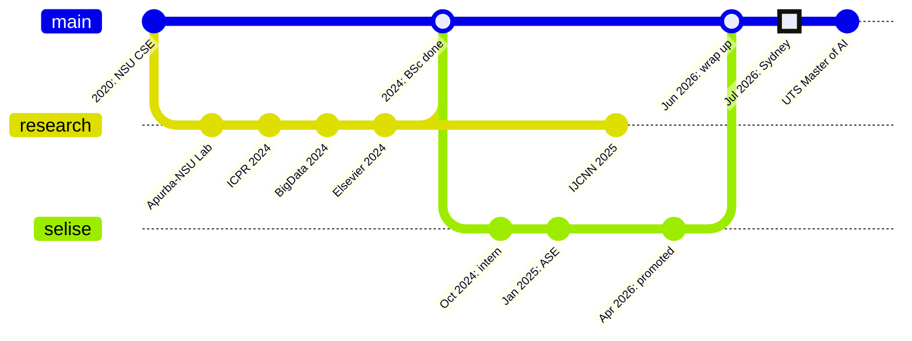

<div align="center">

# `rafeed-sultan`

**a model card, but for a human**

`params: 1 human` · `base: Dhaka` · `fine-tuned: Sydney` · `license: open to collaboration`

<a href="https://scholar.google.com/citations?user=EPt8XpsAAAAJ&hl=en"></a>
<a href="https://www.linkedin.com/in/rafeed-sultan/"></a>
<a href="https://sultanrafeed.github.io/github-portfolio/"></a>
<a href="mailto:sultanrafeed@gmail.com"></a>

</div>

> [!NOTE]
> I evaluate LLMs for a living, so it felt only fair to publish a model card for myself.
> Benchmarks are real. Limitations are honest. Hallucination rate is low but nonzero.

---

## 📇 Model Details

```yaml
model_name:    rafeed-mohammad-sultan
version:       2026.10 (Sydney release)
architecture:  researcher + engineer (mixture of experts, both active)
base_model:    BSc CSE, North South University (2020-2024, AI specialisation)
fine_tuning:   Master of AI, UTS Sydney (2026-2028, in progress)
languages:     [bn (native), en, python, c++]
focus:         [llm-evaluation, alignment, rag, multilingual-nlp, trustworthy-ai, medical-ai]
status:        seeking fully funded PhD offers
```

---

## 📚 Training Data

| Corpus | Epochs | What it taught me |
|:--|:--|:--|
| 🎓 **North South University**, BSc CSE | 2020 → 2024 | Foundations, plus a habit of specialising in AI |
| 🔬 **Apurba-NSU R&D Lab** | 2023 → 2024 | Research under Dr. Nabeel Mohammed & Dr. Shafin Rahman. How to turn a question into a paper |
| 💼 **SELISE Digital Platforms**, Dhaka | Oct 2024 → Jun 2026 | Intern → Associate SE → promoted. Production code, real users, real deadlines |
| 🦘 **University of Technology Sydney**, Master of AI | Jul 2026 → now | Currently training. Loss is going down |

---

## 🏆 Evaluation Results

Peer reviewed, not self reported.

| Benchmark (venue) | Task | Result | Artifacts |
|:--|:--|:--:|:--|
| **ICPR 2024** | *Beyond Labels:* aligning LLMs with human-like reasoning | ✅ accepted | [arXiv](https://doi.org/10.48550/arXiv.2408.11879) · [code](https://github.com/apurba-nsu-rnd-lab/DFAR.git) |
| **IEEE BigData 2024** | Empowering meta-analysis with LLMs for scientific synthesis | ✅ accepted | [arXiv](https://arxiv.org/abs/2411.10878) · [code](https://github.com/EncryptedBinary/Meta_analysis.git) |
| **IJCNN 2025** | *LegalRAG:* hybrid RAG for multilingual legal NLP | ✅ accepted | [arXiv](https://arxiv.org/abs/2504.16121) |
| **Intelligence-Based Medicine** (Elsevier, Q1) | Efficient skin cancer detection via model souping & distillation | ✅ published | [paper](https://www.sciencedirect.com/science/article/pii/S2666521224000437) |

---

## 🎯 Intended Use

**✅ Recommended for**
- Designing evals that catch what accuracy scores hide
- Alignment and reasoning research for LLMs
- RAG pipelines that need to work in more than one language (Bangla included, natively)
- Taking a research idea all the way to code that ships

**⚠️ Known limitations**
- Will happily build a 14-row ablation table when 3 rows would do
- Performance degrades sharply without cha
- Easily distracted by a better evaluation metric
- Still calibrating to Sydney weather

---

## ⚡ Inference Example

```python
>>> from humans import Rafeed
>>> r = Rafeed.from_pretrained("dhaka/nsu-2024").finetune("sydney/uts-mai")

>>> r.generate("What are you looking for?")
'A fully funded PhD in LLM evaluation, alignment, or trustworthy AI.'

>>> r.generate("Anything else?")
'ML / AI engineering roles where evaluation actually matters.'

>>> r.generate("Best way to reach you?")
'sultanrafeed@gmail.com. I reply faster than most APIs.'
```

---

## 🌿 Changelog



---

## 📦 Dependencies

```txt
# requirements.txt
python  c++  c
torch  tensorflow  scikit-learn  transformers  langchain  faiss
fastapi  nodejs  postgresql  mongodb  mysql
react  typescript  docker  aws
mcp        # model context protocol, not minecraft
cha>=2     # cups per day, hard requirement
```

<div align="center">

</div>

---

## 📈 Training Telemetry

<details>
<summary><b>click to expand the loss curves</b> (fine, they're GitHub stats)</summary>
<br/>
<div align="center">


</div>
</details>

---

## 📝 Citation

If this profile was useful to your hiring committee, please cite:

```bibtex
@human{sultan2026,
  title   = {Rafeed Mohammad Sultan},
  author  = {Dhaka, Bangladesh and Sydney, Australia},
  year    = {2026},
  note    = {Open to PhD supervision, research collaborations, and good questions},
  url     = {https://sultanrafeed.github.io/github-portfolio/}
}
```

<div align="center">
<sub>model card last updated Oct 2026 · no humans were overfit in the making of this README</sub>
</div>
