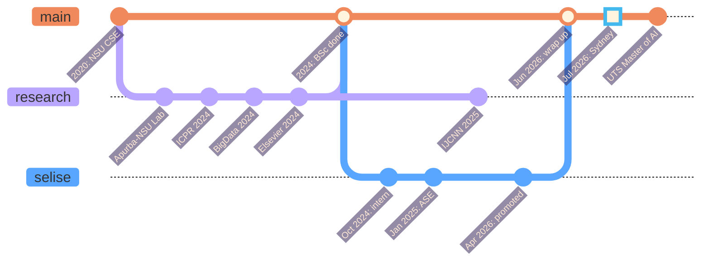

<div align="center">


<sub><i>a model card, but for a human</i></sub>

`params: 1 human` &nbsp;·&nbsp; `base: Dhaka` &nbsp;·&nbsp; `fine-tuned: Sydney` &nbsp;·&nbsp; `license: open to collaboration`

<a href="https://scholar.google.com/citations?user=EPt8XpsAAAAJ&hl=en"></a>
<a href="https://www.linkedin.com/in/rafeed-sultan/"></a>
<a href="https://sultanrafeed.github.io/github-portfolio/"></a>
<a href="mailto:sultanrafeed@gmail.com"></a>

</div>

> [!NOTE]
> I evaluate LLMs for a living, so it felt only fair to publish a model card for myself.
> Benchmarks are real. Limitations are honest. Hallucination rate is low but nonzero.


## 🌌 Model Details

```yaml
model_name:    rafeed-mohammad-sultan
version:       2026.10 (Sydney release)
architecture:  researcher + engineer (mixture of experts, both active)
base_model:    BSc CSE, North South University (2020-2024, AI specialisation)
fine_tuning:   Master of AI, UTS Sydney (2026-2028, in progress)
languages:     [bn (native), en, python, c++]
focus:         [llm-evaluation, alignment, rag, multilingual-nlp, trustworthy-ai, medical-ai]
status:        seeking fully funded PhD offers
```


## 🗺️ The Journey (not to scale)

```
         ☾  ·    ✦          ·        ✦      ·       ✧
    ✧        ·        ·          ✦         ·    ☀
                                                         
   ┌──────────┐      ✈  ~ ~ ~ ~ ~ ~ ~ ~ ~ ~ ~ ~ ~     ┌──────────┐
   │  DHAKA   │  ────────────── 7,000 km ──────────▶  │  SYDNEY  │
   │  🇧🇩  ☕  │       carried: 4 papers, 1 laptop,     │  🇦🇺  🌊  │
   └──────────┘       too many PyTorch checkpoints     └──────────┘
     NSU · lab                                           UTS · MAI
     SELISE                                              what next?
```


## 📚 Training Data

| | Corpus | Epochs | What it taught me |
|:-:|:--|:--|:--|
| 🎓 | **North South University**, BSc CSE | 2020 → 2024 | Foundations, plus a habit of specialising in AI |
| 🔬 | **Apurba-NSU R&D Lab** | 2023 → 2024 | Research under Dr. Nabeel Mohammed & Dr. Shafin Rahman. How to turn a question into a paper |
| 💼 | **SELISE Digital Platforms**, Dhaka | Oct 2024 → Jun 2026 | Intern → Associate SE → promoted. Production code, real users, real deadlines |
| 🦘 | **UTS Sydney**, Master of AI | Jul 2026 → now | Currently training. Loss is going down |


## 🏆 Evaluation Results

<sub>peer reviewed, not self reported</sub>

<table>
<tr>
<td align="center" width="25%">
<h3>🧠</h3>
<b>Beyond Labels</b><br/>
<sub>aligning LLMs with human-like reasoning</sub><br/><br/>
<code>ICPR 2024</code><br/><br/>
<a href="https://doi.org/10.48550/arXiv.2408.11879">arXiv</a> · <a href="https://github.com/apurba-nsu-rnd-lab/DFAR.git">code</a>
</td>
<td align="center" width="25%">
<h3>📊</h3>
<b>LLM Meta-Analysis</b><br/>
<sub>LLMs for scientific synthesis</sub><br/><br/>
<code>IEEE BigData 2024</code><br/><br/>
<a href="https://arxiv.org/abs/2411.10878">arXiv</a> · <a href="https://github.com/EncryptedBinary/Meta_analysis.git">code</a>
</td>
<td align="center" width="25%">
<h3>⚖️</h3>
<b>LegalRAG</b><br/>
<sub>hybrid RAG for multilingual legal NLP</sub><br/><br/>
<code>IJCNN 2025</code><br/><br/>
<a href="https://arxiv.org/abs/2504.16121">arXiv</a>
</td>
<td align="center" width="25%">
<h3>🔬</h3>
<b>Model Soup Skin AI</b><br/>
<sub>skin cancer detection via souping & distillation</sub><br/><br/>
<code>Elsevier Q1</code><br/><br/>
<a href="https://www.sciencedirect.com/science/article/pii/S2666521224000437">paper</a>
</td>
</tr>
</table>


## 🎯 Intended Use

<table>
<tr>
<td valign="top" width="50%">

**✅ Recommended for**
- Designing evals that catch what accuracy scores hide
- Alignment and reasoning research for LLMs
- RAG pipelines that work in more than one language (Bangla included, natively)
- Taking a research idea all the way to code that ships

</td>
<td valign="top" width="50%">

**⚠️ Known limitations**
- Will build a 14-row ablation table when 3 rows would do
- Performance degrades sharply without cha
- Easily distracted by a prettier evaluation metric
- Still calibrating to Sydney weather

</td>
</tr>
</table>


## ⚡ Inference Example

```python
>>> from humans import Rafeed
>>> r = Rafeed.from_pretrained("dhaka/nsu-2024").finetune("sydney/uts-mai")

>>> r.generate("What are you looking for?")
'A fully funded PhD in LLM evaluation, alignment, or trustworthy AI.'

>>> r.generate("Anything else?")
'ML / AI engineering roles where evaluation actually matters.'

>>> r.generate("Best way to reach you?")
'sultanrafeed@gmail.com. I reply faster than most APIs.'
```


## 🌿 Changelog




## 📦 Dependencies

```txt
# requirements.txt
python  c++  c
torch  tensorflow  scikit-learn  transformers  langchain  faiss
fastapi  nodejs  postgresql  mongodb  mysql
react  typescript  docker  aws
mcp        # model context protocol, not minecraft
cha>=2     # cups per day, hard requirement
```

<div align="center">

</div>


## 📈 Training Telemetry

<details>
<summary><b>click to expand the loss curves</b> (fine, they're GitHub stats)</summary>
<br/>
<div align="center">


</div>
</details>


## 📝 Citation

If this profile was useful to your hiring committee, please cite:

```bibtex
@human{sultan2026,
  title   = {Rafeed Mohammad Sultan},
  author  = {Dhaka, Bangladesh and Sydney, Australia},
  year    = {2026},
  note    = {Open to PhD supervision, research collaborations, and good questions},
  url     = {https://sultanrafeed.github.io/github-portfolio/}
}
```

<div align="center">

```
   (  )   (   )  )
    ) (   )  (  (       this README was brewed, not generated.
    ( )  (    ) )       
   _____________        no humans were overfit in the making of it.
  <_____________> ___   
  |             |/ _ \  
  |   rafeed    | | | | 
  |   v2026.10  |_| |_| 
  \_____________/       
```

</div>
